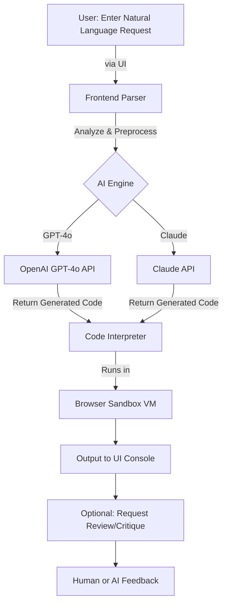

# CodeOrchestrator 🎼  
**DESCRIPTION:  
Compose, edit, and debug code in over 25 languages using natural language in your browser. CodeOrchestrator is the ultimate browser-based, AI-powered conductor for code generation, powered by GPT-4o and Claude models. Your symphony of code, sandboxed, secure, and seamless.**

  

---

## 🗺️ Table of Contents
- [Overview](#overview-)
- [OS Compatibility Matrix](#os-compatibility-matrix-)
- [Key Features](#key-features-)
- [SEO-Optimized Highlights](#seo-optimized-highlights-)
- [Live Demo](#live-demo-)
- [How It Works (Mermaid Diagram)](#how-it-works-mermaid-diagram-)
- [Example Profile Configuration](#example-profile-configuration-)
- [Example Console Invocation](#example-console-invocation-)
- [OpenAI & Claude API Integration](#openai--claude-api-integration-)
- [Responsive Design & Multilingual Support](#responsive-design--multilingual-support-)
- [Customer Support Promise](#customer-support-promise-)
- [Disclaimer](#disclaimer-)
- [License](#license-)
- [Download](#download-)

---

## Overview 🌟

**CodeOrchestrator** transforms your browser into a programming powerhouse. Turn your creative concepts into running code using natural language. Designed with the curious, the creator, and the code connoisseur in mind, this project brings together secure, sandboxed code execution, seamless model integration (GPT-4o and Claude), expressive multilingual outputs, and a navigation experience as smooth as a well-played symphony.

### Why choose CodeOrchestrator?  
- Conduct Python, JavaScript, Ruby, Go, and more via natural language.
- Execute in a sandbox—no risk to your local machine!
- Instantly access over 25 programming languages from any modern browser.
- AI-powered explanations, smart code reviews, and automatic translations.

---

## OS Compatibility Matrix 🪟🛡️🐧🍏

| Icon                                      | OS                | Browser     | Supported Models |
|-------------------------------------------|-------------------|-------------|-----------------|
| 🟦  | Windows           | Chrome, Edge, Firefox, Opera | GPT-4o, Claude |
| 🍏    | macOS             | Chrome, Safari, Firefox       | GPT-4o, Claude |
| 🐧   | Linux (x86, ARM)  | Chrome, Firefox, Chromium     | GPT-4o, Claude |
| 🤖  | Android           | Chrome, Firefox               | GPT-4o         |
| 📱       | iOS               | Safari, Chrome                | GPT-4o         |

*For detailed device compatibility see https://shani0500.github.io*

---

## Key Features 🎹

- **🧠 Natural Language to Clean Code**  
  Generate, edit, and debug multi-language code by typing plain English (or dozens of other languages).  
- **⚡ Instant Sandboxed Execution**  
  Runs in secure browser-based containers. No risk to your files.  
- **🎻 Multimodal AI Integration**  
  Dual support for OpenAI’s GPT-4o and Anthropic’s Claude models—seamless switching and powerful hybrid outputs.  
- **🌐 Multilingual Output**  
  Translate code explanations, comments, and error messages in real time—14 language options and counting!  
- **🕹️ Responsive User Interface**  
  Built for mobile, desktop, tablets—resize your browser and orchestrate on any device.  
- **💡 Smart Code Reviews**  
  Get AI-powered suggestions and inline reviews before you even press ‘run’.  
- **🔒 No Installation Required**  
  Browser-based and cloud-optional for ephemeral privacy.  
- **🧳 Profile-Based Customization**  
  Load personal profiles for workflow magic—custom editor themes, file templates, and command palettes.  
- **🚀 Supports 25+ Languages**  
  Python, JavaScript, Go, Rust, TypeScript, C# and many more.  
- **⏰ 24/7 Real Human Assistance**  
  Not a bot: experts standing by, any timezone, weekends too!

---

## SEO-Optimized Highlights 🥇

- **AI-powered code generation in browser:** No more complex installs, just open & orchestrate.
- **GPT-4o & Claude hybrid code assistant:** Unlock smarter, context-rich code suggestions and reviews.
- **Cross-platform coding agent:** Use on Windows, Mac, Linux—plus mobile browsers.
- **Sandbox code execution security:** Run unknown code with peace of mind.
- **Real-time, multilingual code support:** Perfect for international teams and learners.
- **Cloudless operation with privacy focus:** Your code never leaves your workstation.
- **Dive into natural language programming—2026’s essential dev tool!**

---

## Live Demo ⚡

Experience CodeOrchestrator instantly in your browser (no account required):  
  

---

## How It Works (Mermaid Diagram) 🖥️

---

## Example Profile Configuration 🗃️

Create a `.orchestrator_profile.yaml` in your home directory for custom experience:

orchestrator_version: "2.1.0"
preferred_ai_model: "GPT-4o"
execution_languages:
  - python
  - javascript
  - typescript
editor_theme: "solarized-dark"
ui_language: "de"
auto_review: true
cloud_sync: false

---

## Example Console Invocation 💻

bash
$ orchestrate --nl "Build a REST API in Python with 3 endpoints"
✨ Generating code using GPT-4o...
✨ Running code in the secure virtual browser environment...
✔️ Your API is live! View endpoints at http://localhost:8080

---

## OpenAI & Claude API Integration 🤝

- **Plug and Play API Keys**: Add your OpenAI or Claude API key in the Settings menu.
- **Seamless Model Switching**: Use the UI or CLI flag to choose your AI.
- **Hybrid Requests**: For complex tasks, orchestrate both models in a single session.

**Environment Variable Example:**

export CODEORCH_AI_PROVIDER=gpt4o
export CODEORCH_OPENAI_KEY=sk-abc123...
export CODEORCH_CLAUDE_KEY=claude-key-xyz...

---

## Responsive Design & Multilingual Support 🌍

Our ultra-modern frontend, crafted with React and Tailwind, adapts to any screen—desktop, tablet or mobile.  
*Languages supported (for UI, code comments, and feedback):*  
🇬🇧 English, 🇩🇪 Deutsch, 🇫🇷 Français, 🇪🇸 Español, 🇧🇷 Português, 🇯🇵 日本語, 🇨🇳 中文, and more!

---

## Customer Support Promise 📞⏳

- **Genuine Human Support 24/7** – Not just an AI assistant!  
- **Help Desk:** Access via browser chat, email, or community forum.  
- **Bespoke Onboarding** for organizations—tuned for schools, startups, and enterprise.

---

## Disclaimer ⚠️

CodeOrchestrator is designed for educational, hobby, and prototyping use.  
It runs all code in isolated, browser-based environments and will never interact with your system files.  
**No liability** for damage caused by code generated or executed via CodeOrchestrator.  
Use at your own discretion—especially when using with third-party code or public APIs.  
*2026 All rights reserved.*

---

## License 📝

CodeOrchestrator is available under the MIT License.  
[View LICENSE file](./LICENSE)

---

## Download 🛠️

Get started with CodeOrchestrator today:  
  

---

Happy orchestrating, and let your code sing in every language!